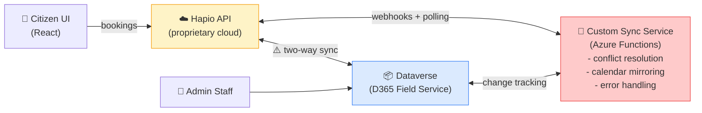
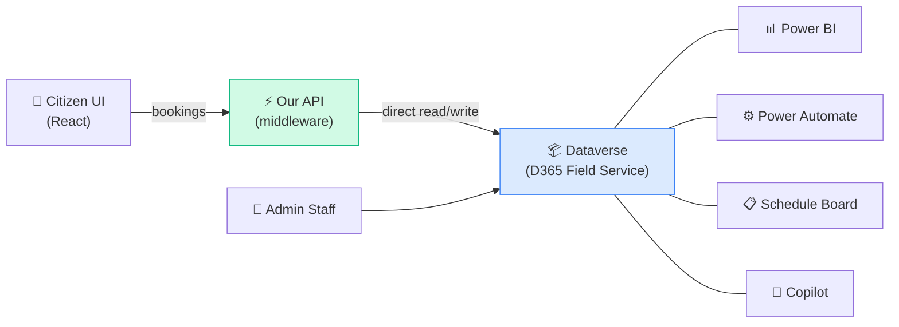

# Feature Comparison: Our Booking Platform vs Hapio

> **Our platform** = citizen-facing booking portal backed by Dynamics 365 Field Service / Dataverse via a custom middleware API.
>
> **Hapio** = headless, API-first booking engine (SaaS, Swedish company).
>
> This document compares what each platform offers today, identifies gaps in both directions, and highlights the strategic advantage of building on D365 Field Service.

---

## At a Glance

| Dimension | Our Platform | Hapio |
|---|---|---|
| **Architecture** | Full-stack app (React SPA + API + Dataverse) | Headless API only (BYO frontend) |
| **Scheduling engine** | Dynamics 365 Universal Resource Scheduling (URS) | Custom-built engine |
| **Data store** | Dataverse (Power Platform) | Hapio cloud (proprietary) |
| **Auth** | Microsoft Entra External ID (citizen) + Azure AD (admin) | API tokens (bearer) |
| **Frontend** | Complete citizen portal (React 19) | React booking-flow component (optional) |
| **Admin UI** | D365 Schedule Board + model-driven apps | Developer Portal only (hapio.app) — no business-user admin UI |
| **Developer tooling** | TypeScript SDK, schema/seed scripts, E2E tests | Developer Portal, PHP SDK, React booking flow component, Postman collection, docs site |
| **Pricing** | D365 Field Service licence ($105/user/mo) | API request-based (free → €1,500/mo) |
| **Deployment** | Vercel (SPA) + Azure (API + Dataverse) | SaaS only |

---

## Detailed Feature Comparison

### 1. Booking Management

| Feature | Ours | Hapio | Notes |
|---|---|---|---|
| Create booking | ✅ | ✅ | |
| Cancel booking | ✅ | ✅ | |
| Modify / reschedule booking | ❌ | ✅ | We only cancel + rebook |
| Conflict detection (pre-submit) | ✅ | ✅ | We call `checkConflict()` before creating |
| Double-booking prevention | ✅ | ✅ | |
| Booking notes / metadata | ✅ | ✅ | We store on `tn_citizenservicebooking` |
| Booking groups (multi-resource) | ❌ | ✅ | Hapio can book court + coach in one call |
| Temporary / hold bookings | ❌ | ✅ | |
| Booking window (min/max lead time) | ❌ | ✅ | D365 portal supports this; we haven't implemented it |
| Booking history per user | ✅ | ✅ | My Bookings page with upcoming/past tabs |
| Booking status workflow | ✅ | ✅ | D365 provides Scheduled→Traveling→In Progress→Complete→Canceled |
| Optimistic UI updates | ✅ | N/A | We update TanStack Query cache immediately |

### 2. Availability & Time Slots

| Feature | Ours | Hapio | Notes |
|---|---|---|---|
| Real-time availability | ✅ | ✅ | |
| Configurable slot duration | ✅ | ✅ | Per-category duration options |
| Multi-duration per service | ✅ | ✅ | Sports Pitch: 60/90/120 min |
| Resolution-based grid (GCD) | ✅ | ❌ | Our grid decouples display resolution from booking duration |
| Buffer / changeover time | ✅ | ✅ | Per-category buffer minutes |
| Capacity per slot | ✅ | ✅ | ExpandCalendar returns `Effort` for multi-capacity |
| Period grouping (AM/PM/Eve) | ✅ | ❌ | Morning, Afternoon, Evening sections |
| Multi-cell span selection | ✅ | ❌ | Visual cell merging for multi-slot bookings |
| Day-based bookings | ❌ | ✅ | Hapio supports bookings measured in days |
| Flexible-length bookings | ❌ | ✅ | Hapio supports arbitrary duration (seconds to years) |
| Timezone support | ❌ | ✅ | D365 supports it but we haven't exposed it |

### 3. Resource Management

| Feature | Ours | Hapio | Notes |
|---|---|---|---|
| Facility resources | ✅ | ✅ | D365 `bookableresource` with `resourcetype=Facility` |
| Resource categories / grouping | ✅ | ✅ | 6 service categories |
| Resource-specific work hours | ✅ | ✅ | Via D365 calendar per resource |
| Variable schedules (e.g. reduced Fridays) | ✅ | ✅ | iCalendar recurrence patterns via `msdyn_SaveCalendar` |
| Capacity per resource | ✅ | ✅ | Calendar `Effort` field (e.g. 20 for recycling, 30 for gym) |
| Auto resource allocation | ❌ | ✅ | Hapio has random/priority/equalization strategies |
| Resource pools | ❌* | ✅ | *D365 supports pools natively; we haven't used them |
| Equipment resources | ❌* | ✅ | *D365 supports equipment; we only use Facility type |
| People resources | ❌* | ✅ | *D365 supports User/Contact resources; we don't use them |
| Crew scheduling | ❌* | ❌ | *D365 has native crew support; Hapio does not |
| Characteristics / skills | ❌* | ❌ | *D365 has proficiency-rated characteristics; Hapio does not |
| Distance-based sorting | ✅ | ❌ | Haversine distance from user to venue |
| Busyness indicators | ✅ | ❌ | Quiet/Moderate/Busy badges from today's bookings |

> Items marked ❌* = available in D365 but not yet exposed in our citizen portal.

### 4. Location / Multi-Location

| Feature | Ours | Hapio | Notes |
|---|---|---|---|
| Multiple locations | ✅ | ✅ | 28 venues across Leeds |
| Location-based resource assignment | ✅ | ✅ | Via category associations |
| Location coordinates | ✅ | ✅ | Lat/lng on organizational units |
| Distance sorting | ✅ | ❌ | Resources sorted by proximity to user |
| Location CRUD via API | ❌ | ✅ | Our locations come from Dataverse admin |

### 5. Calendar & Scheduling Engine

| Feature | Ours | Hapio | Notes |
|---|---|---|---|
| Recurring schedules | ✅ | ✅ | Via iCalendar `FREQ` patterns |
| Variable weekly patterns | ✅ | ✅ | Different hours per day, seasonal |
| Business closures | ✅* | ❌ | *D365 has org-wide closures; Hapio doesn't mention this |
| Time off requests | ✅* | ❌ | *D365 supports per-resource time off with approval |
| Work hours templates | ✅* | ❌ | *D365 can bulk-apply templates to 25 resources |
| ExpandCalendar API | ✅ | ❌ | Native D365 function; no equivalent in Hapio |
| Schedule Board (admin) | ✅* | ❌ | *Full Gantt/list/map views for dispatchers |
| Schedule Assistant | ✅* | ❌ | *AI-assisted resource matching |
| Resource Scheduling Optimization | ✅* | ❌ | *Automated overnight/intraday scheduling ($30/resource/mo add-in) |
| Booking rules (JS validation) | ✅* | ❌ | *Custom validation before booking creation |
| Fulfillment preferences | ✅* | ❌ | *Control interval display and time groups |

> Items marked ✅* = available in D365 but not directly surfaced in our citizen portal.

### 6. Authentication & Identity

| Feature | Ours | Hapio | Notes |
|---|---|---|---|
| Citizen authentication | ✅ (Microsoft Entra External ID) | ❌ | Hapio is API-only; auth is BYO |
| Auto-provisioning contacts | ✅ | N/A | ContactProvider creates Dataverse contact on first login |
| Role-based access | Partial | ❌ | We have citizen role; admin via D365 security roles |
| API token auth | ✅ | ✅ | |
| Granular API permissions | ❌ | ✅ | Hapio has per-token permission config |

### 7. Real-Time & Notifications

| Feature | Ours | Hapio | Notes |
|---|---|---|---|
| Real-time updates (WebSocket) | ✅ (SignalR) | ❌ | We auto-invalidate caches on booking changes |
| Webhooks | ❌ | ✅ | Hapio has signed webhooks with replay protection |
| Booking reminders | ❌ | ✅ | Hapio supports configurable reminder webhooks |
| Email notifications | ❌ | ✅* | *Hapio references this; achievable via Power Automate for us |
| SMS notifications | ❌ | ✅* | *Same — achievable via Power Automate |

### 8. Developer Experience

| Feature | Ours | Hapio | Notes |
|---|---|---|---|
| REST API | ✅ | ✅ | |
| TypeScript SDK | ✅ | ❌ | `@truenorth-it/dataverse-client` |
| PHP SDK | ❌ | ✅ | |
| React UI components | ✅ (full app) | ✅ (booking flow widget) | |
| API documentation | ❌ | ✅ | Hapio has docs.hapio.io |
| Postman collection | ❌ | ✅ | |
| Developer portal | ❌ | ✅ | hapio.app for project/token/webhook management |
| API request logs | ✅ | ✅ | Our ApiStatsPanel shows call history |
| Schema/seed scripts | ✅ | N/A | `npm run schema`, `npm run seed` |
| E2E tests (Playwright) | ✅ | ❌ | |

### 9. Analytics & Reporting

| Feature | Ours | Hapio | Notes |
|---|---|---|---|
| API stats panel | ✅ | ✅ | Live call count, latency, SignalR status |
| Booking analytics | ❌ | ❌ | Neither has rich analytics today |
| Power BI integration | ✅* | ❌ | *Dataverse data flows directly into Power BI |
| Busyness tracking | ✅ | ❌ | Real-time quiet/moderate/busy per venue |

### 10. AI / Copilot

| Feature | Ours | Hapio | Notes |
|---|---|---|---|
| Copilot scheduling agent | ✅* | ❌ | *2025 wave 2 — intelligent resource matching |
| Natural language queries | ✅* | ❌ | *Copilot side pane in D365 for admin users |
| Booking summaries | ✅* | ❌ | *AI-generated summaries of booking activity |

---

## What We Need to Add (Gaps vs Hapio)

### High Priority

| Gap | Effort | How |
|---|---|---|
| **Booking modification / reschedule** | Medium | Add reschedule flow — update existing booking times instead of cancel + rebook |
| **Webhooks / notifications** | Medium | Power Automate flows triggered on booking create/cancel → email/SMS to citizen |
| **Booking reminders** | Medium | Power Automate scheduled flow — query upcoming bookings, send reminder email/SMS |
| **Booking window (min/max lead time)** | Low | Add `tn_minleaddays` / `tn_maxleaddays` to category metadata, enforce in slot grid |
| **Timezone display** | Low | Show times in user's local timezone (D365 already stores UTC) |

### Medium Priority

| Gap | Effort | How |
|---|---|---|
| **Temporary / hold bookings** | Medium | Create booking with a "Hold" status, auto-expire via Power Automate after N minutes |
| **Multi-resource booking groups** | High | Use D365 Requirement Groups — book facility + equipment/staff together |
| **Auto resource allocation** | Medium | Leverage D365 Schedule Assistant API or implement priority/equalization logic |
| **Flexible-length bookings** | Low | Allow free-form duration input (not just preset options) |
| **API documentation** | Medium | Document our middleware API endpoints |

### Low Priority

| Gap | Effort | How |
|---|---|---|
| **Day-based bookings** | Low | Add a "days" duration mode for services like storage/rentals |
| **Granular API token permissions** | Medium | Middleware API enhancement |
| **PHP SDK** | Low | Not needed unless third-party PHP consumers exist |
| **Signed webhooks** | Low | Add HMAC signatures to outbound webhook calls |

---

## What Hapio Would Need to Match Us

These are capabilities we have (via D365 Field Service) that Hapio fundamentally cannot offer as a standalone SaaS booking engine.

### Cannot Replicate (Strategic D365 Advantages)

| Capability | Why It Matters |
|---|---|
| **Data lives in Dataverse** | Bookings, resources, calendars — all in the council's own Dataverse environment. No external data silo, no sync layer needed. Hapio stores everything in its own proprietary cloud. |
| **Schedule Board** | Full admin UI with Gantt, map, and list views for managing venues and bookings. No equivalent in Hapio — you'd need to build a custom admin app. |
| **ExpandCalendar API** | Native calendar expansion with recurrence, breaks, capacity, time zones. Hapio computes availability but doesn't expose the raw calendar infrastructure. |
| **Booking Rules** | Custom validation before any booking — business-specific logic (e.g., "no under-16s after 8pm", "max 2 bookings per citizen per day"). Hapio has no pre-booking validation hooks. |
| **Power Platform integration** | Power Automate flows for notifications/approvals, Power BI dashboards for utilisation reporting, Power Apps for custom admin screens — all connect to the same booking data with zero integration work. Hapio is isolated. |
| **Copilot / AI** | Natural language scheduling, AI-assisted resource matching, booking summaries. No AI features in Hapio. |
| **Resource pools** | Group similar facilities (e.g., "any available squash court") and assign the specific court later. Hapio has no equivalent. |
| **Audit trail** | Dataverse audit log on every entity — who changed what, when. Hapio has API request logs but no data-level audit. |
| **GDPR via Dataverse** | Built-in data subject requests, retention policies, field-level security. |
| **Security roles** | Granular role-based access for admin users — dispatchers, venue managers, service owners. Built into the platform. |

### Would Need to Build

| Capability | Effort for Hapio |
|---|---|
| Real-time UI updates (SignalR/WebSocket) | High — they'd need to add push to their API |
| Distance-based resource sorting | Medium — they'd need location data on resources + Haversine |
| Busyness indicators | Medium — they'd need to compute from booking density |
| Citizen identity + auto-provisioning | Medium — they'd need to add user management |
| Period grouping (AM/PM/Evening) | Low — frontend feature in their React component |
| Multi-cell span selection with visual merging | Medium — frontend feature |
| Resolution-based grid (GCD of durations) | Medium — needs frontend + API changes |
| Category-specific UI (icons, colours) | Low — frontend metadata |
| Full citizen portal (search, browse, book, my bookings) | High — they only provide a booking flow widget |

---

## The Strategic Picture

### Why D365 Field Service Backing Is Huge

1. **Single pane of glass** — Citizens book through our portal; council staff manage through D365 Schedule Board. Same data, same bookings, same calendars. No sync, no integration, no data duplication.

2. **Extensibility without code** — Need a booking confirmation email? Power Automate flow, 10 minutes. Need a dashboard? Power BI, connect to Dataverse, done. Need a custom approval step? Power Apps.

3. **Enterprise-grade from day one** — Security roles, audit logging, GDPR compliance, backup/restore, environment management — all included in the platform. Hapio would need to build all of this.

4. **AI-ready** — Copilot features are rolling out across D365. Our bookings automatically benefit from AI summaries, scheduling intelligence, and natural language interaction as Microsoft ships updates.

5. **Cost at scale** — D365 Field Service is $105/user/month for admin users. Citizens don't need licences (they access via our API). Hapio's €599/month plan caps at 250K API requests — a busy council with 28 venues could exceed this.

6. **Data stays in Dataverse** — This is the fundamental issue with Hapio. Bookings live in Hapio's proprietary cloud, not in the council's Dataverse environment. That means:
   - Council staff can't see citizen bookings on their D365 Schedule Board
   - Power Automate flows can't trigger on booking events
   - Power BI can't report on booking data without a sync layer
   - Existing D365 workflows, security roles, and audit trails don't apply
   - You'd need to build and maintain a two-way sync between Hapio and Dataverse — defeating the purpose of having Dataverse in the first place
   - With our approach, a booking created by a citizen at 9am is visible to a dispatcher on the Schedule Board at 9:01am. Same record, same entity, no sync.

7. **No operational tooling** — Hapio's Developer Portal is for developers managing API tokens and viewing request logs. There's no admin UI for business users — no schedule board, no drag-and-drop rescheduling, no map view, no resource utilisation dashboard. A council venue manager would need a completely custom admin app built on top of Hapio. With D365, the Schedule Board is ready out of the box.

### What Would It Actually Take to Use Hapio with a Dataverse Customer?

This is the critical question. If the customer is strategically committed to Dataverse (which council/government customers typically are), using Hapio means running **two backends** with a sync layer between them:

**What you'd need to build and maintain:**

| Component | Effort | Ongoing Cost |
|---|---|---|
| **Two-way sync service** — Hapio bookings → Dataverse bookableresourcebooking, and vice versa for admin-created bookings | High | Azure Functions hosting + monitoring |
| **Conflict resolution** — What happens when a booking is created in both systems simultaneously? | High | Edge cases forever |
| **Calendar sync** — Hapio schedules must mirror D365 work hours, capacity, and business closures | High | Every calendar change needs propagating |
| **Resource sync** — Venues/resources must exist in both systems with matching IDs | Medium | Every new venue needs creating in both |
| **Status mapping** — Hapio statuses ↔ D365 booking statuses | Low | But must be maintained |
| **Admin UI** — Hapio has no admin dashboard, so you still need D365 Schedule Board or a custom app | N/A | Council staff use D365 regardless |
| **Hapio subscription** — €249-599/mo depending on request volume | N/A | On top of existing D365 licence costs |

**The fundamental problem:** The customer already pays for D365 Field Service which includes a complete scheduling engine (URS), calendar infrastructure (ExpandCalendar), and admin tooling (Schedule Board). Hapio duplicates all of this, adds a sync tax, and introduces a second source of truth for booking data.

**Compare with our approach:**

One backend, one source of truth, zero sync. Everything flows through Dataverse — citizen bookings, admin operations, automations, and reporting all hit the same data.

### What Hapio Does Better (Today)

1. **Developer onboarding** — Hapio has excellent docs, a Postman collection, and a free tier. Our platform requires D365 setup + API deployment + Microsoft Entra External ID config.

2. **API-first purity** — Hapio is truly headless with clean REST endpoints. Our API layer is middleware translating Dataverse operations, adding some overhead.

3. **Booking groups** — Book multiple resources in a single API call. We'd need to implement this using D365 Requirement Groups.

4. **Webhooks** — Signed, with replay protection and configurable reminders. We have real-time via SignalR but no outbound webhooks.

5. **Multi-tenant SaaS** — Hapio runs isolated projects per customer with no infrastructure management. Our platform requires Azure + Dataverse environment per deployment.

---

## Recommended Roadmap

### Phase 1: Parity Features (Quick Wins)
- [ ] Booking modification / reschedule flow
- [ ] Booking window (min/max lead time)
- [ ] Email confirmation on booking (Power Automate)
- [ ] Booking reminder emails (Power Automate)

### Phase 2: Competitive Advantage
- [ ] Expose D365 Schedule Board for admin users
- [ ] Multi-resource booking (Requirement Groups)
- [ ] Webhook notifications (outbound)
- [ ] API documentation

### Phase 3: Platform Differentiation
- [ ] Copilot integration for citizen-facing booking assistance
- [ ] Power BI dashboards for venue utilisation
- [ ] Resource pools for flexible venue management
